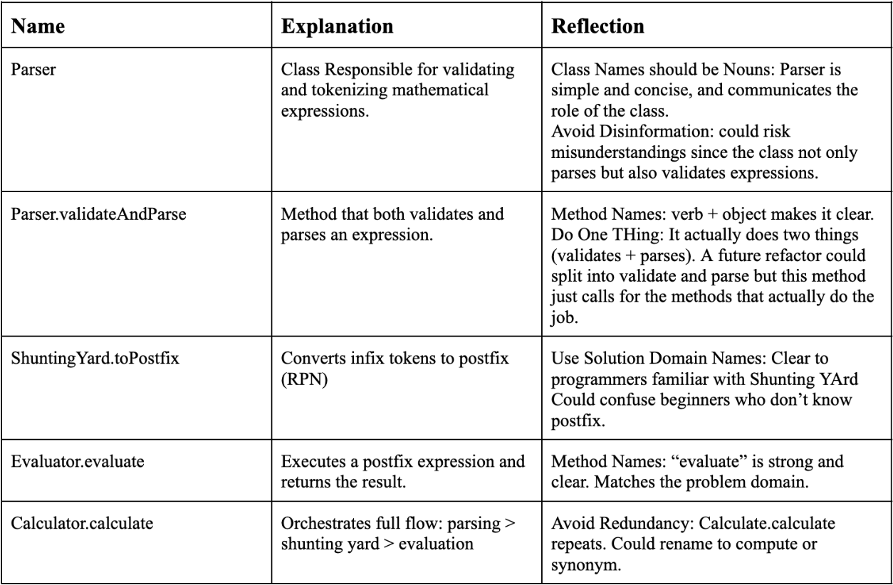
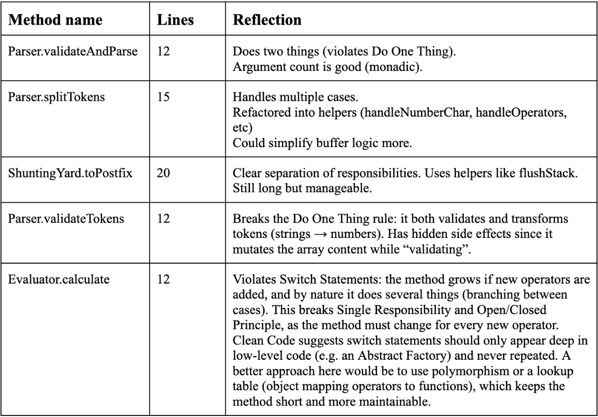

# Reflection
## Naming (Chapter 2)

While implementing my module, I tried to follow Clean Code’s principle of “meaningful names”. For Example, the method validateAndParse is explicit about its purpose and what it does. However, I also see that the name might violate “Do one Thing” since it combines two responsibilities. A possible future refactor could be to split this into two separate methods, which would align better with the single-responsibility principle.

On the other hand, I disagree with the idea that shorter names are always better, or that the principle should always be applied strictly. validateAndParse is a short wrapper method that delegates work to several smaller validation and parsing methods. The process of validating in my code is quite long and requires multiple steps and methods which I thought was crucial to mention in the name. Only mentioning the parsing (e.g. if I were to rename it to parseExpression /  a method name I have in the module but in the main Calculator class when I call for validateAndParse) would risk misleading other developers into assuming validation was implicit, which is an ambitious assumption.

In contrast, the class name Parser could be seen as misleading because it suggests the class only parses. In practice, much of its code is dedicated to validation as well. The Clean Code principle of each class only being responsible for one thing is something I believe I still followed hence why I decided to still only name it Parser. Being responsible for one thing does not mean it can only do one thing. Validation is a natural part of parsing, and an outer class does not need to know the internal details of how parsing is implemented. Therefore, I decided to keep the simpler name Parser for the class, while using more explicit validateAndParse for the method inside it.

## Functions (Chapter 3)

At first my functions were too long and mixed multiple concerns. After applying Clean code ideas and principles, I refactored them into smaller helpers. For example, splitTokens was refactored into handleNumberChar and handleOperator. This increased readability and made testing easier as well.

However, sometimes I felt the book’s advice for very small functions could be quite limiting and was not always the smartest approach for better readability or understandability. My balance was to create helpers only when they reduced duplication or clarified intent. Most of the time, breaking the code into smaller methods made it easier to read, but sometimes it could have the opposite effect. One concrete example is validateAndParse. According to “Do One Thing”, this method could be split into validate and parse. I deliberately chose not to, because the class already contained many fine-grained methods that handle specific validation steps. Splitting this wrapper method would, in my opinion, make the code harder to follow as a whole, since a reader would need to scroll through multiple small methods just to understand the overall process. In this case I believe clarity at the class level was more important than strictly following single responsibility rule.

In Chapter 3, one of the guidelines is that functions should avoid side effects, or at least make them very explicit. Looking back, I noticed that many of my methods technically have side effects that aren’t obvious from their names. For example, validateTokens(tokens) not only validates but also transforms all number strings into Number objects and returns a new array. Similarly, flushBuffer(buffer, tokenizedExpression) both clears the buffer and appends to another array, which is not fully communicated in the function name. Another example is checkSequence(tokens), which doesn’t return a value but instead throws an error if the sequence is invalid. From the name alone, someone might expect it to return a boolean instead of having an exception as a side effect.

At first, I avoided using parameters and relied on shared state (this.validTokens). That created hidden side effects, because functions were mutating the same internal data. Refactoring them to accept parameters improved this. Now it’s clearer what input is being used, and easier to test different cases without relying on hidden state. I also realized that passing parameters improves readability. For example, checkSequence(tokens) makes it clear that the function operates on a given token array, instead of hiding that dependency.

## Reflection
### My own code quality
Looking back, my code quality has improved significantly as I applied Clean Code principles throughout this assignment. My early versions often had unclear variable names, redundant method calls, and functions that tried to do too much. I still consider these early steps important, since they helped me figure out the core logic before worrying about style. For me, trying to focus on Clean Code too early actually prevented progress. Instead, I first wrote most of the code in larger functions, and once I confirmed the logic worked, I refactored according to Clean Code principles. This step made my code much more readable and easier to understand. It also helped me later on: whenever I revisited my code, it was easier to recall my original thought process and problem-solving approach.

This assignment involved implementing the Shunting Yard algorithm, which requires many control statements and checks to ensure correct validation and conversion of expressions. At times, I felt overwhelmed, because I needed to think ahead about the next step in the logic. Over time, I improved at refactoring while coding. I learned to recognize when a smaller helper method was needed, even before I knew exactly how to implement the logic. For example, when writing toPostfix, I knew I had to check each token, handle numbers and operators separately, and compare operator precedence. Even if I didn’t have the exact solution yet, I could create method placeholders to structure the logic. This made the refactoring process smoother, and my code became easier to both read and test.

Following the DRY principle also saved me a lot of time. Whenever I noticed repeating code, such as checking if something was a number or an operator, I refactored it into helper methods (isOperator, isNumber, etc.) that could be imported and reused across classes. This reduced duplication and made the codebase more consistent.

I think this is the cleanest code I’ve written so far, and it’s a project I feel confident I could return to in the future and still understand clearly. In contrast, some of my previous assignments feel messy and confusing to revisit. Of course, there are still parts I could improve to better follow Clean Code, but I also realized that the principles should not be followed blindly. Smaller methods are only helpful when they increase clarity or remove duplication. Very short functions can sometimes reduce readability instead of improving it. For example, I find long but clear for loops often easier to understand than compressed one-liners using map or filter, which require holding the entire process in your head instead of seeing it step by step.

One of the most valuable lessons I took away was the idea that “good function names are often better than comments.” I tend to over-explain in comments, but I realized many of them could be replaced with new methods that clearly communicate their purpose. Another area I reflected on was naming: while avoiding overlapping names is ideal, sometimes it cannot be avoided. Words like result are naturally reused in different scopes. Still, I tried to improve by making names more specific (e.g., finalResult, calculationResult), which makes the code less confusing for readers.
Overall, I feel I struck a good balance between applying Clean Code principles and keeping my code practical and understandable.

### This assignment and my personal development
Another important aspect for me, beyond Clean Code itself, was how this assignment helped with my imposter syndrome. In my first year, I often felt that I relied too heavily on AI tools. While they can be useful as assistants, it’s easy to become dependent on them. This project was different because it was based on my own choice of module, had fewer fixed requirements, and required me to write the code myself without generative AI. That experience gave me confidence and made me realize that I can code much more than I thought.
I also learned where much of my imposter syndrome comes from: the belief that I need to solve every problem entirely on my own. But through this assignment I saw that many concepts, such as the Shunting Yard algorithm or using a stack in the evaluator, are well-known algorithms. I’m not expected to reinvent them from scratch, the value is in learning how they work and then implementing them myself. While I could not have invented the Shunting Yard algorithm, I did manage to code my own full implementation of it.

Applying Clean Code principles supported this process as well. By breaking the problem into smaller methods, I was able to move forward step by step instead of feeling overwhelmed by the complexity. Large problems turned into a collection of smaller ones, each solved by a helper function or control statement. This approach not only made my code cleaner but also made problem-solving itself easier.
A good example was parentheses support. Initially, I decided not to implement it because I felt it was too complex while I was still struggling with PEMDAS. But now that I’m finished, I can see how I could add it later. It wouldn’t require a fundamentally new approach, just additional validation rules and more control statements. For example, I would need to allow expressions to start with a parenthesis, enforce that they are properly closed, and check what can appear before or after them. Thinking in smaller steps makes this seem achievable, when it felt impossible before.