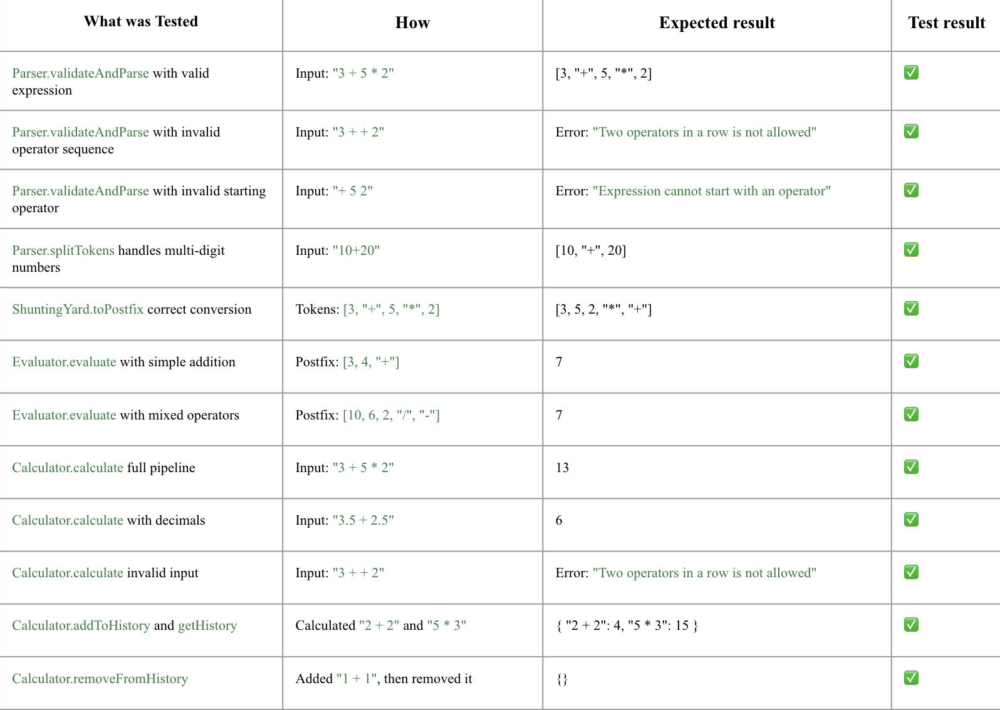

# Test Report
## Summary
The calculator module was tested using manual unit tests written in JavaScript. Each class (Parser, ShuntingYard, Evaluator, Calculator) was tested separately in its own test file. The tests were run by executing each test file with Node.js via npm scripts.

The testing covered: <br>
- **Parsing and validation** of input expressions, including correct tokenization, handling of multi-digit and decimal numbers, and validation of invalid sequences.
- **Conversion** from infix notation to postfix (RPN) using the Shunting Yard algorithm.
- **Evaluation** of postfix expressions, ensuring correct operator precedence and arithmetic results.
- **Integration** via the Calculator class, which orchestrates the flow and manages history.

## How to run the tests
1. Install dependencies
```bash
npm install
```
2. Run a single test file

Parser:
```bash
npm run test:parser
```
ShuntingYard:
```bash
npm run test:shuntingyard
```
Evaluator:
```bash
npm run test:evaluator
```
Calculator:
```bash
npm run test:calculator
```

## Test results

